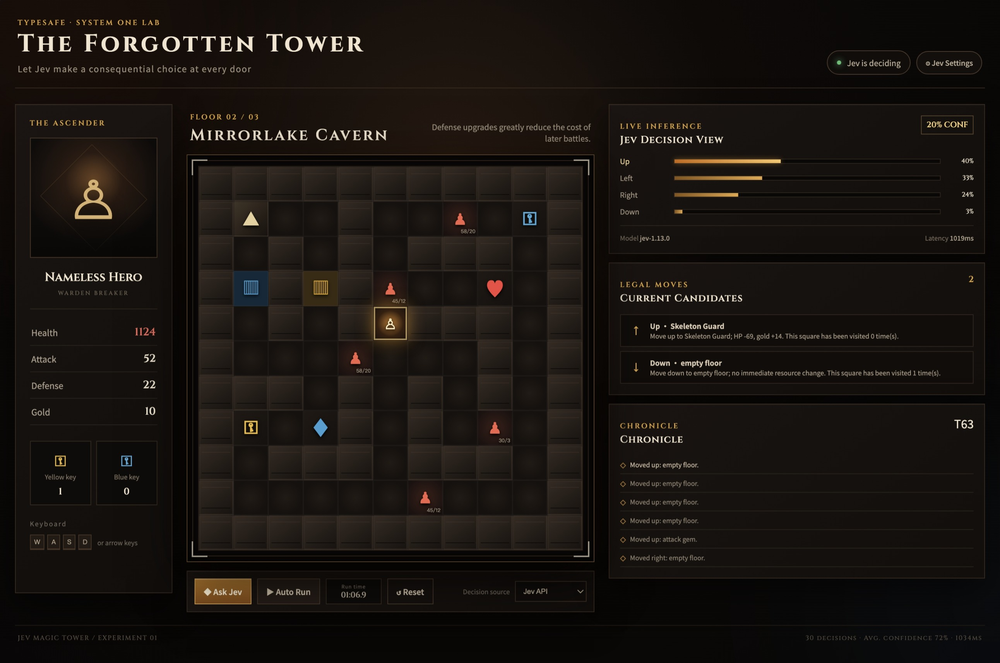

# The Forgotten Tower · Jev Magic Tower

**English** | [中文](README-zh.md)

A three-floor Magic Tower game for observing TypeSafe Jev's strategic judgments. Players can explore manually or let Jev choose among every legal move. The interface displays the complete probability distribution, confidence, model name, and latency for each decision in real time.



The project uses a layered architecture that keeps deterministic game rules, use-case orchestration, the Jev adapter, and web delivery independent. Only the domain rules can mutate game state; Jev supplies bounded strategic judgments that remain testable, replaceable, and easy to extend.

## Gameplay and evaluation goals

- Three 11×11 floors containing doors, keys, potions, gems, regular enemies, and a final boss.
- The application calculates every legal move and its deterministic outcome before Jev selects among the candidates. Jev never mutates game state directly.
- Candidate descriptions include resource changes and visit counts, exposing how Jev weighs health, permanent upgrades, scarce keys, exploration, and detours.
- Auto Run is response-driven: after one Jev result is applied, the updated state is immediately used for the next request, with no fixed delay between decisions.
- A wall-clock timer runs during Auto Run, including Jev API latency, and freezes when the run stops, fails, or reaches the ending.
- Chinese and English are built in. The first visit follows the browser language; users can explicitly select Chinese, English, or automatic detection in Jev Settings.
- When no API key is available or a request fails, the application uses a clearly labeled local baseline so the UI remains testable. Baseline results are never presented as Jev output.
- Manual play supports arrow keys, `WASD`, and clicking adjacent tiles.

## Run with one command

After installing [uv](https://docs.astral.sh/uv/), run this command in the project directory:

```bash
uv run jev-magic-tower
```

`uv` automatically creates an isolated environment, installs the locked dependencies, and starts the application without requiring manual virtual-environment setup. Open <http://127.0.0.1:8093>.

Use **Jev Settings** in the upper-right corner to configure the API key, API URL, model, and interface language. Page-provided credentials live only in server process memory and are never written to the browser or disk. On restart, the application continues to read `TYPESAFE_API_KEY`, `TYPESAFE_BASE_URL`, and `TYPESAFE_MODEL` from the environment by default. Without a key, select **Local baseline** as the decision source for offline use.

Run the checks with:

```bash
uv run --extra dev pytest
uv run --extra dev ruff check .
```

## Project structure

```text
src/magic_tower/
├── domain/                  # Entities, floor definitions, combat, and movement rules
├── application/             # Use-case services, localization, and decision-engine ports
├── infrastructure/          # TypeSafe SDK, environment, and HTTP adapters
├── web/static/              # Build-free browser interface
└── main.py                  # Composition root
tests/                       # Domain, application, configuration, and localization tests
```

## Jev request boundary

`JevDecisionEngine` submits one `Choice` question:

- `state`: hero resources, current floor, recent events, turn number, and the long-term objective.
- `criteria`: every currently legal direction, with the deterministic resource changes and historical visit count for its destination.
- Result: the selected action, probabilities for all actions, and confidence.

The domain rules decide whether a door can open, an enemy can be defeated, how much combat damage is taken, what an item changes, and when a floor transition occurs. This guarantees that model output can trigger only a currently legal action and allows Jev and the local baseline to be compared against the same game state.

## Configuration

| Variable | Default | Description |
| --- | --- | --- |
| `TYPESAFE_API_KEY` | None | TypeSafe API key |
| `TYPESAFE_BASE_URL` | `https://api.typesafe.ai` | API base URL |
| `TYPESAFE_MODEL` | `jev-latest` | System One model |
| `HOST` | `127.0.0.1` | Web server bind address |
| `PORT` | `8093` | Web server port |
